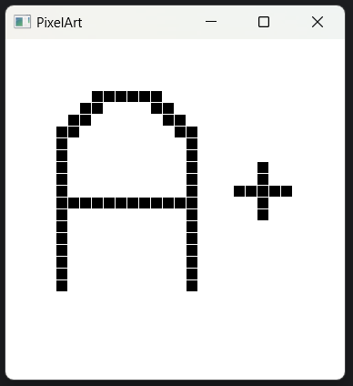

# Bruksanvisning
I core mappen benytter du deg av terminalen og kjører:
1: mvn compile
2: mvn test
3: mvn javafx:run

Tilhører brukerhistorie 1:
Her har vi gjort det slik at:
Etter at appen åpner er det fritt frem å tegne.
Dette gjøres ved å bruke musen og trykke på skjermen.
Hvis du ønsker å viske ut kan du bruke høyreklikk på samme pixel. 

Tilhører brukerhistorie 2: 
coming soon

### Eksemple bilde av kunst: 
 