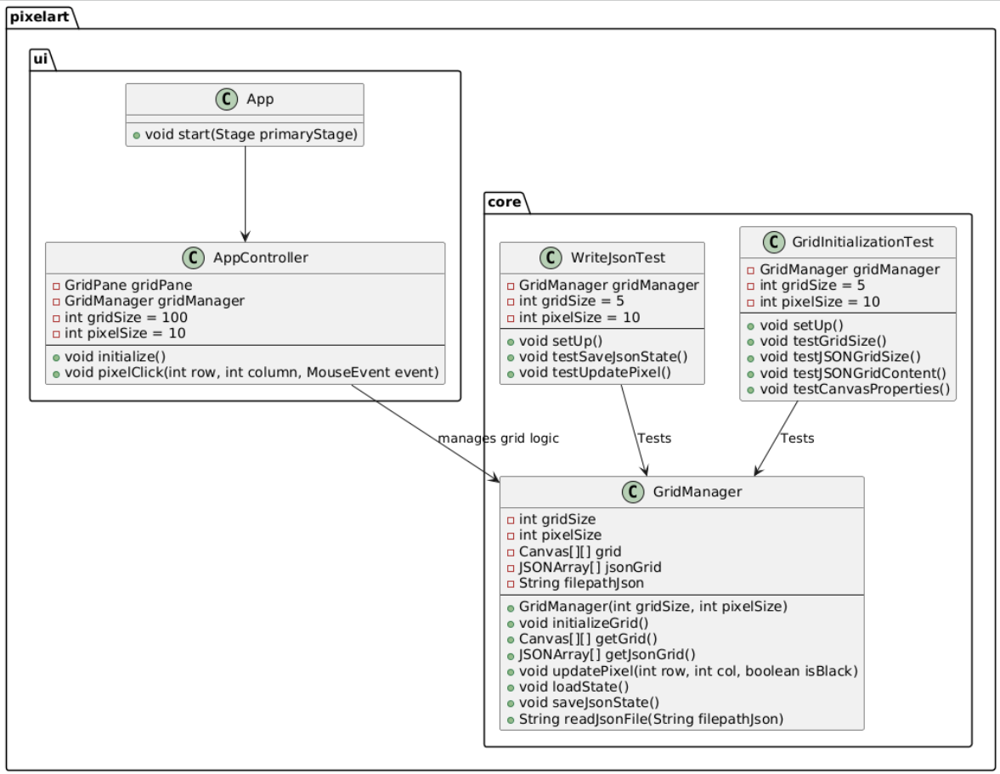

# Release 2

## Endringer
- Vi delte opp prosjektet i to moduler, én for kjernekoden (logikk og serialisering) og en for brukergrensesnittet.
- Lagt til filoppdatering (JSON matrise). Pixel-grid lagres som json i en matrise hvor hvert pixel endten er "W" eller "B" fom forteller om pixelet er svart eller hvitt.
- Vi har forbedret tester.


## Arkitektur
Arkitekturen har to moduler, core og ui. I core modulen er kjerneklassen GridManager og i ui modulen er brukergrensesnittet. Videre benytter vi oss også av en "server" komponent, her ligger jsonfilene som vår fungerende bakside.
Baktanken bak funksjonaliteten er så enkelt som at vi lager 10 000 små canvas objekter som fyller ut hver sin gridPane, når vi ønsker en piksel farget, så fyller vi rektangelet som har riktig matrise indeks.

### Core
I core er kjerneloggikken for lesing, oppdatering og lagring av lerretet. Den tar seg av fillagring, og henter lagrede data ved oppstart slik at UI kan hente lerretet som er lagret. 

### UI
UI har frontendklassen som styrer fxml filen. Den bruker kjerneklassen GridManager fra core til å hente matrisen som forteller tilstanden til hvert pixel. Deretter lager den et pixel-grid som brukeren kan trykke på. Når et pixel oppdateres kaller den på GridManager i core til å oppdatere filen.

## Testing
Vi bruker Jacoco for å holde orden på testdekningsgraden, slik at vi har god oversikt over hvor forbedringer til koden kan gjøres. Ved å se dekningsgraden har vi selv blitt oppmerksomme på hvordan vi kan forbedre koden, samt se svakheter.
Spotbugs utnyttes for å få hjelp til å oppdage bugs som eksisterer i koden vår. Denne synes vi er vanskelig å bruke for nå, men vi ser verdien av å bruke dette!
Checkstyle brukes for å holde kodestilen til en viss standard. Dette hjelper oss med å gjøre koden leselig og kan hjelpe med å forbedre kvaliteten.



PlantUML kode: se vedlegg A 

### Persistance

#### Implicit persistance
We decided upon a "start" where you "stopped" solution, the thought process where to continue drawing right where you stopped, and while the grid is pretty big, there is a lot of space to fill out. We're also eyeing developing this further into a save and upload as you go.

#### Userdata
The data is saved as "canvas" where the canvas key in the json canvas file has a matrix of a 100 * 100 first initialized strings of "W". With clicking on a pixel canvas the "W" is changed to a "B", representing "White" and "Black".
{"canvas":[["W","W","W".....
## Valg vi har tatt

### Gitlab
Vi har prøvd å forbedre vår bruk a standard prosedyre. Vi har begynt å bruke standard commit melding oppsett. Med bruk av denne malen:

```
<type>[optional scope]: <description>

[optional body]

[optional footer(s)]
```
Vi har som mål at alle commits som er synlige på main branchen følger denne malen.
Vi sletter overflødige grener. Vi har valgt å bruke squash commits for å slå sammen tidligere commits når vi merger til master.

Vi benytter oss av spotbugs og checkstyle, selvom det er vanskelig å anvende nå i starten. Vi har manglende erfaring med begge, men ser viktigheten bak det.

## Bruk av KI
[Release 2](ai-tools.md)


### Vedlegg A

PlantUML code

```
@startuml

class pixelart.core.GridManager {
    -int gridSize = 100
    -int pixelSize = 10
    -Canvas[][] grid
    -JSONArray[] jsonGrid
    -String filepathJson = "jsonCanvas.json"
    
    +GridManager()
    -void initializeGrid()
    +Canvas[][] getGrid()
    +void updatePixel(int row, int col, boolean isBlack)
    +void loadState()
    -void saveJsonState()
    -String readJsonFile()
}

class pixelart.ui.App {
    +void start(Stage primaryStage)
}

class pixelart.ui.AppController {
    -GridPane gridPane
    -GridManager gridManager

    +void initialize()
    -void pixelClick(int row, int column, MouseEvent event)
}

class pixelart.server.JsonFileTests {
    +void testSaveJsonCanvasState()
    +void testLoadState()
}

pixelart.core.GridManager --> pixelart.ui.AppController : "uses"
pixelart.ui.AppController --> pixelart.core.GridManager : "manages"
pixelart.ui.App --> pixelart.ui.AppController : "manages"
pixelart.server.JsonFileTests --> pixelart.core.GridManager : "tests"

@enduml
```