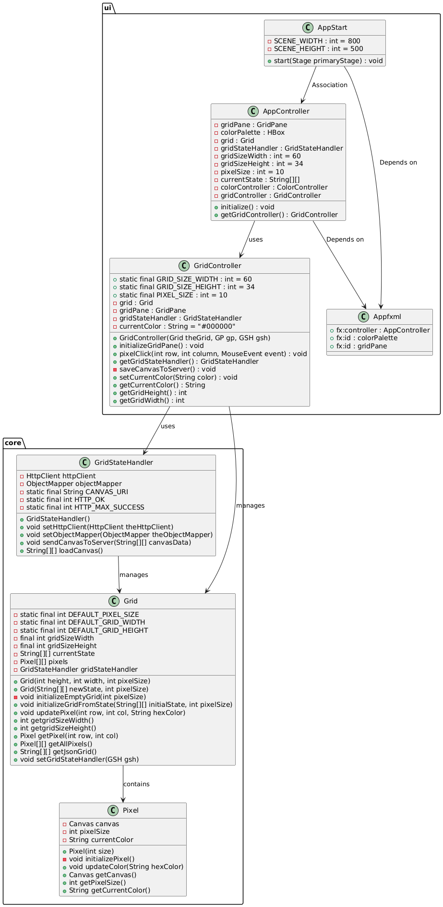

# Klassediagram

Her har vi valgt å vise hvordan core og ui modulene våre interagerer.



``` bash

@startuml

  package ui {
    class AppStart {
    - SCENE_WIDTH : int = 800
    - SCENE_HEIGHT : int = 500
    + start(Stage primaryStage) : void
      }
    class AppController {
    - gridPane : GridPane
    - colorPalette : HBox
    - grid : Grid
    - gridStateHandler : GridStateHandler
    - gridSizeWidth : int = 60
    - gridSizeHeight : int = 34
    - pixelSize : int = 10
    - currentState : String[][]
    - colorController : ColorController
    - gridController : GridController
    + initialize() : void
    + getGridController() : GridController
      }

    class GridController {
    + static final GRID_SIZE_WIDTH : int = 60
    + static final GRID_SIZE_HEIGHT : int = 34
    + static final PIXEL_SIZE : int = 10
    - grid : Grid
    - gridPane : GridPane
    - gridStateHandler : GridStateHandler
    - currentColor : String = "#000000"

    + GridController(Grid theGrid, GP gp, GSH gsh)
    + initializeGridPane() : void
    + pixelClick(int row, int column, MouseEvent event) : void
    + getGridStateHandler() : GridStateHandler
    - saveCanvasToServer() : void
    + setCurrentColor(String color) : void
    + getCurrentColor() : String
    + getGridHeight() : int
    + getGridWidth() : int
      }
    class Appfxml {
    + fx:controller : AppController
    + fx:id : colorPalette
    + fx:id : gridPane
    }
}

package core {
  class Grid {
      - static final int DEFAULT_PIXEL_SIZE
      - static final int DEFAULT_GRID_WIDTH
      - static final int DEFAULT_GRID_HEIGHT
      - final int gridSizeWidth
      - final int gridSizeHeight
      - String[][] currentState
      - Pixel[][] pixels
      - GridStateHandler gridStateHandler
      + Grid(int height, int width, int pixelSize)
      + Grid(String[][] newState, int pixelSize)
      - void initializeEmptyGrid(int pixelSize)
      + void initializeGridFromState(String[][] initialState, int pixelSize) 
      + void updatePixel(int row, int col, String hexColor)
      + int getgridSizeWidth()
      + int getgridSizeHeight()
      + Pixel getPixel(int row, int col)
      + Pixel[][] getAllPixels()
      + String[][] getJsonGrid()
      + void setGridStateHandler(GSH gsh)
      }
  class GridStateHandler {
      - HttpClient httpClient
      - ObjectMapper objectMapper
      - static final String CANVAS_URI
      - static final int HTTP_OK
      - static final int HTTP_MAX_SUCCESS
      + GridStateHandler()
      + void setHttpClient(HttpClient theHttpClient)
      + void setObjectMapper(ObjectMapper theObjectMapper)
      + void sendCanvasToServer(String[][] canvasData)
      + String[][] loadCanvas()
      }
  class Pixel {
      - Canvas canvas
      - int pixelSize
      - String currentColor
      + Pixel(int size)
      - void initializePixel()
      + void updateColor(String hexColor)
      + Canvas getCanvas()
      + int getPixelSize()
      + String getCurrentColor()
      }
    
' Relationships
AppController --> Appfxml : "Depends on"
AppStart --> AppController : " Association"
AppStart --> Appfxml : "Depends on"
AppController --> GridController : "uses"

GridController --> Grid : "manages"
GridController --> GridStateHandler : "uses"
Grid --> Pixel : "contains"
GridStateHandler --> Grid : "manages"


@enduml

```

[Tilbake til innholdsfortegnelsen](README.md)
