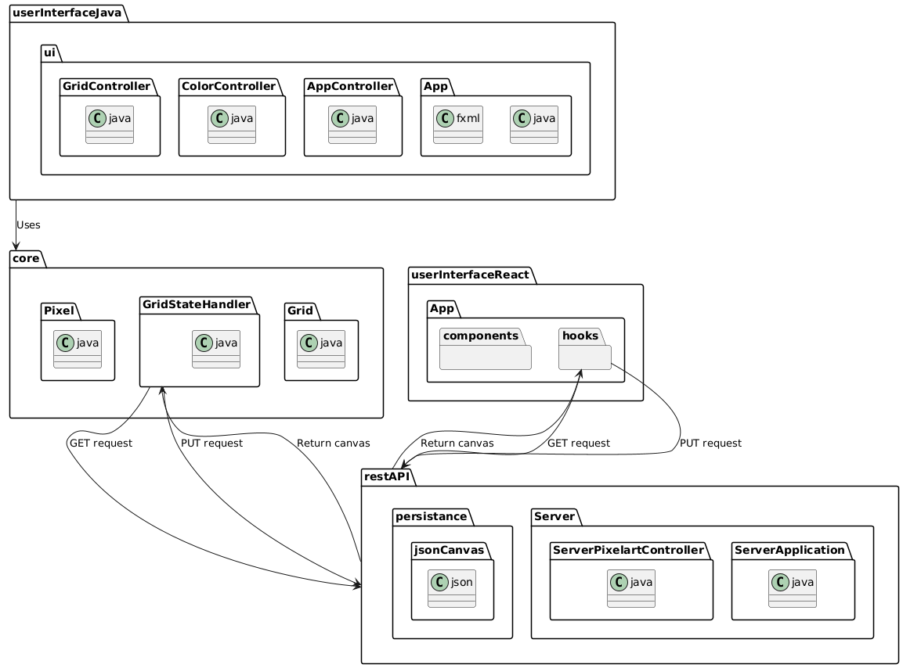

# Pakkediagram

Her er det en oversikt over våre pakker og hvordan de forholder seg til hverandre.



``` bash

@startuml
skinparam classAttributeIconSize 0
skinparam nodePadding 10

package userInterfaceJava{
  package ui {
    class App.java
    class AppController.java
    class ColorController.java
    class GridController.java 
    class App.fxml
  }
}

package core {
  class Grid.java
  class GridStateHandler.java
  class Pixel.java
}

package restAPI {
  package Server {
  class ServerApplication.java
  class ServerPixelartController.java
  }

  package persistance{
    package jsonCanvas {}
  }
}

@startuml
package userInterfaceReact{
  
  package App {
    package hooks {}
    package components {}
  }
  
}

package core {
  class Grid.java
  class GridStateHandler.java
  class Pixel.java
}

package restAPI {
  package Server {
  class ServerApplication.java
  class ServerPixelartController.java
  }
  package persistance{
    class jsonCanvas.json
  }
}

restAPI --> hooks : "Return canvas           "
hooks --> restAPI : "GET request                 "
hooks --> restAPI : "PUT request     "
GridStateHandler --> restAPI : "GET request      "
restAPI --> GridStateHandler : "Return canvas "
GridStateHandler --> restAPI : "PUT request          "
userInterfaceJava --> core : "Uses"

@enduml

```
