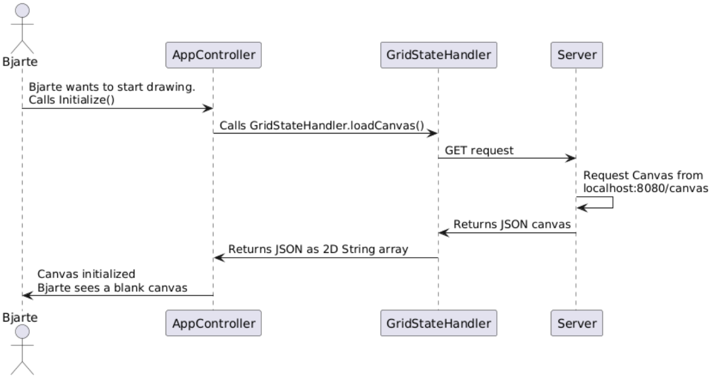

# Sekvensdiagram

Her viser vi hvordan det fungerer om kunstner Bjarte har lyst til å begynne å tegne.



``` bash

@startuml
actor       Bjarte as Foo1
participant AppController as Foo2
participant GridStateHandler as Foo3
participant Server as Foo4
Foo1 -> Foo2 : Bjarte wants to start drawing. \nCalls Initialize()
Foo2 -> Foo3 : Calls GridStateHandler.loadCanvas()
Foo3 -> Foo4 : GET request
Foo4 -> Foo4 : Request Canvas from \nlocalhost:8080/canvas
Foo4 -> Foo3 : Returns JSON canvas
Foo3 -> Foo2 : Returns JSON as 2D String array
Foo2 -> Foo1 : Canvas initialized \nBjarte sees a blank canvas
@enduml
```

[Tilbake til innholdsfortegnelsen](README.md)
